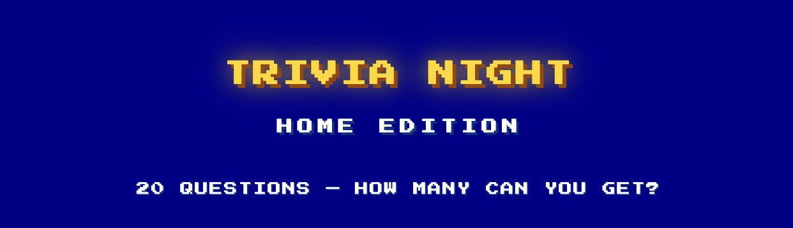

# Trivia Night: Home Edition

A browser-based trivia game with a retro 80s arcade aesthetic — built for fun and to sharpen vanilla web skills.

---

## Gameplay

- **Start a game** — Click **PRESS START** to fetch 20 fresh trivia questions from the Open Trivia Database API.
- **Answer questions** — Four multiple-choice answers are displayed for each question. Select the one you think is correct.
- **Get instant feedback** — Your chosen answer is highlighted red or green immediately, and the correct answer is always revealed.
- **Advance** — Hit **NEXT →** to move to the next question after answering.
- **Track your score** — Your running score is displayed throughout the game.
- **Leaderboard** — After all 20 questions, your final score is automatically inserted into the Top 10 leaderboard so you can see how you stack up.
- **Play again** — Hit **PLAY AGAIN** to start a new round with a fresh set of questions.

---

## Built With

| Technology | Purpose |
|---|---|
| **HTML5** | Page structure and semantic markup |
| **CSS3** | Retro 8-bit / Jeopardy-style layout and animations |
| **Vanilla JavaScript (ES6+)** | Game logic, DOM manipulation, API calls |
| **Open Trivia Database API** | Free, crowd-sourced trivia questions ([opentdb.com](https://opentdb.com)) |
| **Google Fonts** | Press Start 2P & VT323 pixel/CRT fonts |

No frameworks, no build tools — just plain HTML, CSS, and JavaScript.

---

## Contact

**Ben Manning**
📧 [ben@manningdev.com](mailto:ben@manningdev.com)